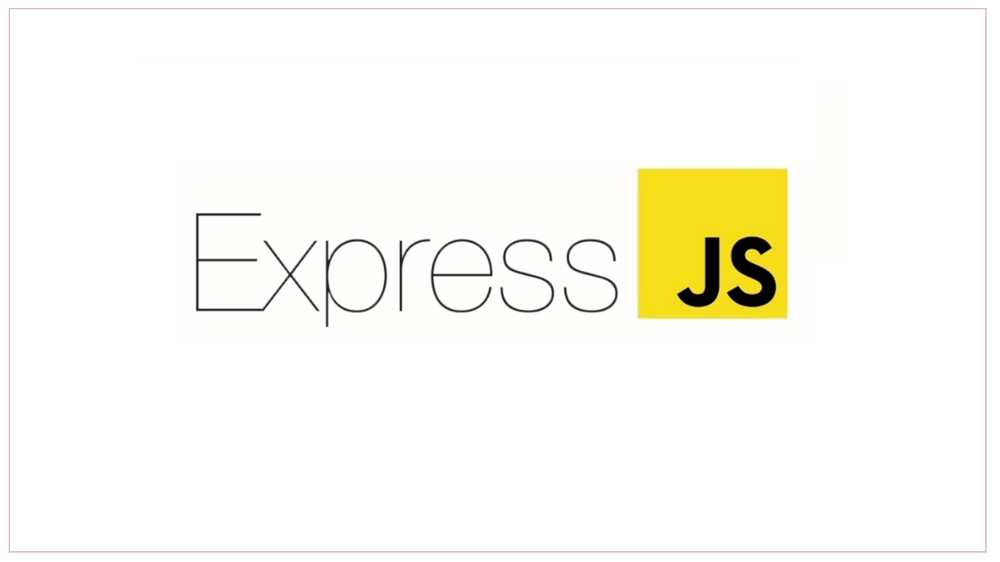

## GUÍA PROYECTO FINAL TF300H

## ECOCLOSET

Ecocloset en una aplicación que conecta de manera rápida y sencilla estos consumidores de moda sostenible con los emprendimientos que generan un cambio en la industria de la moda, para generar un cambio eficaz y moderno con el uso de herramientas a la vanguardia de la tecnología y siempre buscando el objetivo de ser sostenibles.

Ofrecemos distintas prednas de vestir y accesorios de moda, siempre pensando en el impacto ambiental generado al planeta, buscando ser generadores de cambio y ofreciendo alternativas sostenibles a nuestros compradores.

## DESCRIPCION DEL PROYECTO

Ecocloset en una aplicación que conecta de manera rápida y sencilla estos consumidores de moda sostenible con los emprendimientos que generan un cambio en la industria de la moda, para generar un cambio eficaz y moderno con el uso de herramientas a la vanguardia de la tecnología y siempre buscando el objetivo de ser sostenibles.

## Descripcion Backend

1. INICIALIZAR PROYECTO EN NODE: Generar las directivas para crear el proyecto en en Node, inicializando el proyecto, ejecutandolo, instalando las dependencias y demás necesario para generar todas las funcionalidades.

2. INICIALIZAR EL SERVIDOR CON EXPRESS: Esto se hace con el fin de configurar la terminal local como servidor que permita conectar toda la información y loas herramientas, importando las dependencias y los modulos, configurando el uso del servidor y ejecutandolo.

3. EJECUTAR MONGO DB: A partir de esto se generan las bases de datos utilizadas para el proyecto de Ecocloset, en nuestro caso dirigidas a los productos a ofrecer y a los registros de usuarios de la plataforma, esto estructurando las carpetas, configurando las dependencias, conectando la base de datos.

4. CREAR MODELOS DE DATOS: Al final generamos 2 archivos de JS que contendran nuestra lista de base de datos, conectandola con todo el proyecto.

## AUTORES
  Proyecto realizado por Santiago Gutierrez (Como desarollador) y Camilo Fetiva (Como SCRUM Master ) para el Bootcamp de Desarrollo Web 2024  