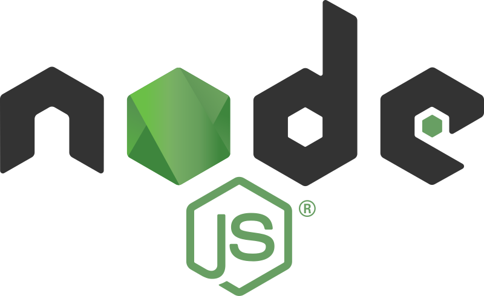
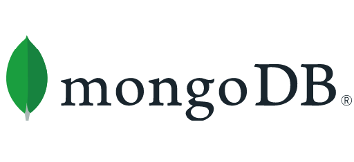

## DESCRIPCION BACKEND

1. INICIALIZAR PROYECTO EN NODE: Generar las directivas para crear el proyecto en en Node, inicializando el proyecto, ejecutandolo, instalando las dependencias y demás necesario para generar todas las funcionalidades.

2. INICIALIZAR EL SERVIDOR CON EXPRESS:
    - Se configura en el archivo de JS
    - import express from 'express'; (Importar las dependencias y módulos necesarios)
    - const app = express(); (CONFIGURAR EL USO DEL SERVIDOR)
    - const port = 3000; (Establecer un puerto para el uso del servidor)
    - app.listen(port, () => {
            console.log ('Soy el server ejecutandose correctamente en el puerto ', port);
        }); (EJECUTAR EL SERVIDOR EN EL COMPUTADOR)
    

3. EJECUTAR MONGO DB: A partir de esto se generan las bases de datos utilizadas para el proyecto de Ecocloset, en nuestro caso dirigidas a los productos a ofrecer y a los registros de usuarios de la plataforma, esto estructurando las carpetas, configurando las dependencias, conectando la base de datos.

4. CREAR MODELOS DE DATOS: Al final generamos 2 archivos de JS que contendran nuestra lista de base de datos, conectandola con todo el proyecto.
