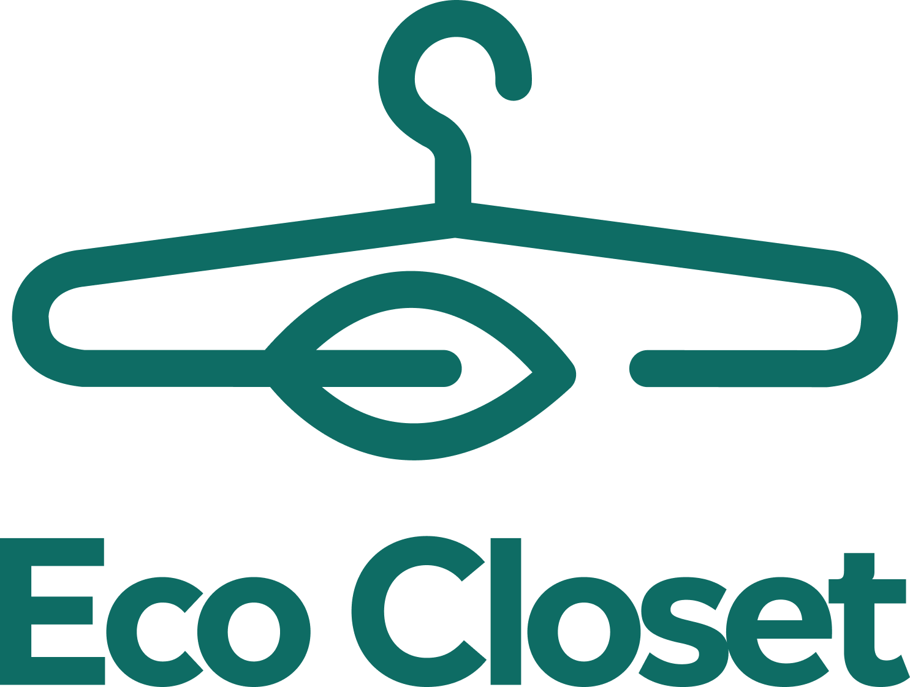

## GUÍA PROYECTO FINAL TF300H

## ECOCLOSET

Ecocloset en una aplicación que conecta de manera rápida y sencilla estos consumidores de moda sostenible con los emprendimientos que generan un cambio en la industria de la moda, para generar un cambio eficaz y moderno con el uso de herramientas a la vanguardia de la tecnología y siempre buscando el objetivo de ser sostenibles.

Ofrecemos distintas prednas de vestir y accesorios de moda, siempre pensando en el impacto ambiental generado al planeta, buscando ser generadores de cambio y ofreciendo alternativas sostenibles a nuestros compradores.

## DESCRIPCION DEL PROYECTO

Ecocloset en una aplicación que conecta de manera rápida y sencilla estos consumidores de moda sostenible con los emprendimientos que generan un cambio en la industria de la moda, para generar un cambio eficaz y moderno con el uso de herramientas a la vanguardia de la tecnología y siempre buscando el objetivo de ser sostenibles.

## AUTORES
  Proyecto realizado por Santiago Gutierrez (Como desarollador) y Camilo Fetiva (Como SCRUM Master ) para el Bootcamp de Desarrollo Web 2024  